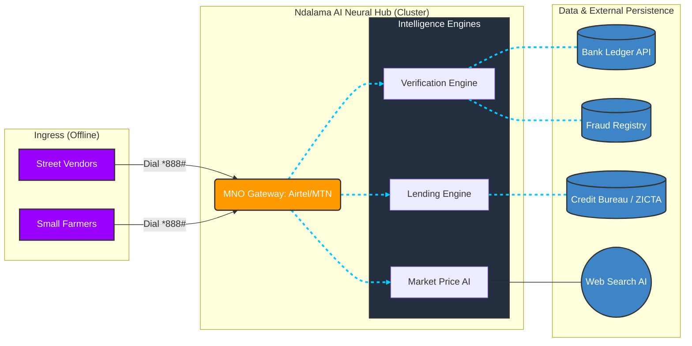

# NdalamaLite: Digital Economic Security for Zambia
**KSU FinTech High School Hackathon Submission**

## 1. Market & Users [Choice: Zambia 🇿🇲]
- **Target Users:** Rural shop owners, street vendors, and small-scale farmers.
- **Context:** Mobile-first, internet-last. These users rely on basic feature phones and **Airtel/MTN Money** (ZMW).

## 2. The Problems [Requirement: Two Specific Fraud Issues]
1. **SMS Receipt Spoofing:** Fraudsters show vendors fake deposit SMS alerts. Goods are handed over for $0.
2. **Fake Agents:** Scammers pose as mobile money agents to manipulate transactions on a vendor's phone.

## 3. The NdalamaLite AI Feature Hub
NdalamaLite (`*888#`) is a **Zero-Install** security and financial hub living inside the default dialer.
- **1. Bank Verification Agent (BVA):** Direct API query to verify real-time deposits, bypassing spoofed SMS.
- **2. Audio-Visual Fraud Shield:** Triggers a red screen and loud speaker alarm for detected scams. Perfect for low-literacy users.
- **3. AI Micro-Lending:** Instant loans based on mobile history (Airtime/Utility consistency). No paperwork required.
- **4. Market Price AI:** Uses a web-crawling agent to fetch fair prices for local staples (Maize, Mint, Groundnuts).
- **5. CilimbaGuard:** AI risk monitoring for savings groups to trigger emergency payouts during droughts or economic shocks.

## 5. Deployment Strategy: How it gets on ALL phones [Judging Criterion 5]
- **One-Step Network Deployment:** Because NdalamaLite is a **USSD Shortcode (`*888#`)**, it does not requires app store distribution.
- **MNO Integration:** By partnering with just **two** companies (Airtel and MTN), we instantly "deploy" NdalamaLite to **every single SIM card in Zambia**—regardless of phone age or model.
- **Zero-Barrier Scale:** No downloads, no data, no updates. If the phone can make a call, it has NdalamaLite.

## 4. Why It Wins (Simple, Practical, Scalable)
- **Simple:** Familiar USSD interface. No data or smartphones needed.
- **Practical:** Directly solves "Verification Anxiety" for everyday street transactions.
- **Scalable:** The USSD-to-API architecture works across Safaricom (Kenya), EcoCash (Zimbabwe), and Paga (Nigeria).

## 6. System Architecture [Architectural Blueprint]

## 7. Business Model & Sustainability [Judging Criterion 5]
- **Operational Costs:** Managed via cloud-native backend (low overhead) and USSD gateway partnerships.
- **Revenue Model:** 
    - **B2B Partnership:** MNOs (Airtel/MTN) pay a flat fee to reduce fraud and build trust.
    - **Micro-Transaction:** A tiny "Safety Fee" of **K0.20 (approx. $0.01)** per verification, deducted from mobile airtime.
- **Sustainability:** The cost of one "Safety Fee" is **1,000x cheaper** than the average fraud loss of K200-K800.

---

## 6. Judges’ FAQ (Walk-around Prep)
- **Is this in the market yet?** No, most tools are silent and text-only. We are the first to use **Audio Alarms** for USSD accessibility.
- **How does it work without internet?** USSD is a signal-layer protocol. Our backend handles the AI/API heavy lifting, sending only small text packets to the phone.
- **What if the phone is stolen?** The verification menu is locked behind a **4-digit PIN**, protecting the vendor's financial data.
- **Future Growth?** We plan to integrate with **Airtel/MTN Developer Portals** for live production data.

